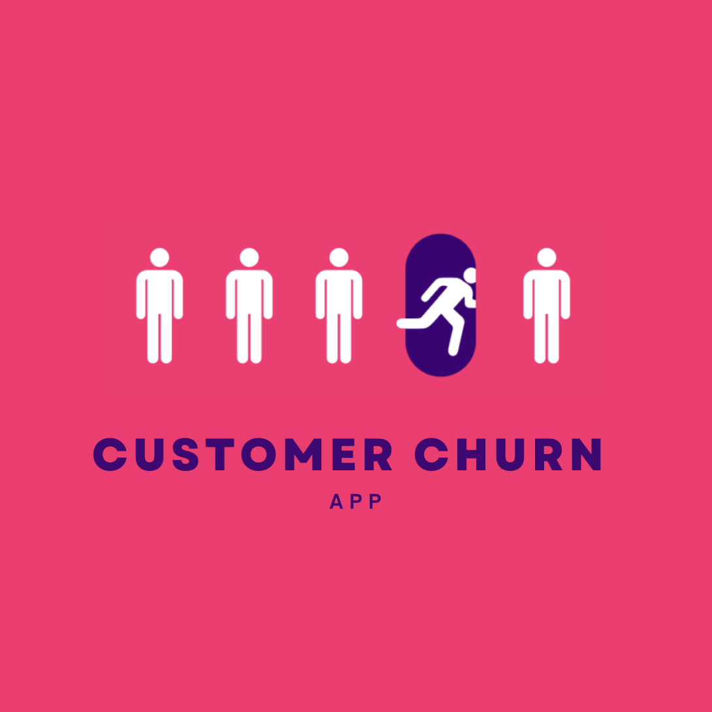

# 
# Customer Churn Detection App

This web application is designed to predict **customer churn** using an **Artificial Neural Network (ANN)**. Built with **Streamlit**, a Python library for creating interactive web applications, the app provides a user-friendly interface to predict the likelihood of a customer discontinuing their service.

### Live Demo:
Explore the live demo of the application at [Customer Churn Prediction App](https://alsra-customer-churn-prediction-main-i14ob1.streamlit.app).

### Overview:
Customer churn, where customers discontinue their relationship with a business, is a critical issue for companies seeking to improve retention rates. Predicting churn allows businesses to identify at-risk customers and implement retention strategies proactively. 

This app uses a **pre-trained Artificial Neural Network (ANN)** to predict customer churn based on multiple customer-related features such as demographics, usage patterns, and service history.

The dataset used for model training is sourced from IBM's publicly available **Telco Customer Churn dataset**, which can be accessed [here](https://community.ibm.com/community/user/businessanalytics/blogs/steven-macko/2019/07/11/telco-customer-churn-1113).

### Key Insights:
1. **Class Imbalance Handling:**
   - The target variable in the dataset exhibits class imbalance, with fewer churned customers compared to non-churned ones. Class imbalance can negatively impact model performance, so I applied **SMOTE (Synthetic Minority Over-sampling Technique)** to balance the dataset before model training. This ensures the model doesn't bias predictions toward the majority class.

2. **Model Selection and Evaluation:**
   - In the exploration phase, several models such as **XGBoost** and **Logistic Regression** were evaluated. However, the **ANN (Artificial Neural Network)** outperformed others in terms of the **ROC-AUC score**, making it the most suitable model for churn prediction in this case.
   - **ROC-AUC** is particularly important for evaluating the model's ability to discriminate between churned and non-churned customers, and this ANN model achieved the highest score.

3. **Model Training:**
   - The ANN was trained on the preprocessed data, which includes customer demographics, service usage, and transaction history. The model was designed to handle the complexities of the data and effectively predict churn outcome.

### Features of the App:
- **User Input:** The app allows users to input various customer features (such as tenure, payment method, and service usage) to predict whether the churn will happen or not.
- **Model Output:** After processing the input, the app provides a prediction indicating whether the customer is likely to churn or not, based on the ANN model's output.

### Usage:

To run the application locally, follow these steps:

1. Clone the repository:
 ```
git clone https://github.com/your-username/customer-churn-prediction.git
 ```
2. Install the required dependencies:
```
pip install -r requirements.txt
```
3. Run the Streamlit app after runing you can find the app in your local host:
```bash
streamlit run main.py
```


